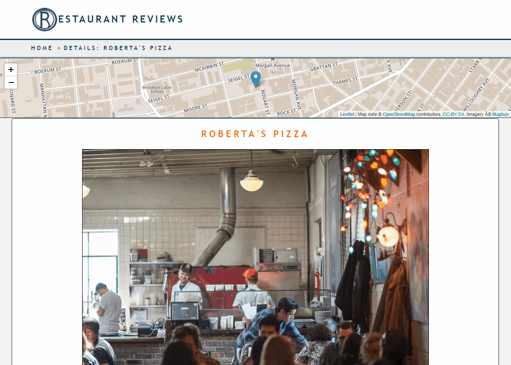

# Restaurant Reviews App Stage 1 | Udacity FEND | 2018

Project five of seven for Udacity's Front End Web Developer Nanodegree; completed as part of the Grow with Google Scholarship program, 2018.

## Authors

The starter code for the project was provided by Udacity; the original repository can be accessed [here](https://github.com/udacity/mws-restaurant-stage-1).

In accordance with instructions and a rubric provided by Udacity, I -- Udacity student Jacob Olson -- edited the files `index.html`, `restaurant-info.html`, `styles.css`, `main.js`, `restaurant_info.js` and `README.md`, all provided with the starter code, and also added the files `styles-428plus.css`, `styles-498plus.css` and `sw.js`, and added files to the `img` folder, to implement the following: mobile-first responsive design, updates to the app's styling, enhanced accessibility features focusing on tab index, semantic markup and ARIA, and a service worker enabling offline functionality. 

In addition to signifigant edits made to portions of the starter code, I added some features seen in this project in their entirety, including in particular: a shrinking navigation bar on scroll down, a radio-group pattern that allows users to navigate through and interact with elements inside the map when it comes in to focus and a scroll-to-top button, all intended to enhance accessibility and overall user experience.

## Instructions

1. Create a local directory on your machine and clone the repository to it. For help with this step, see [this tutorial from GitHub](https://help.github.com/articles/cloning-a-repository/ "GitHub Help — Clone a Repository").

2. You will need to start up an HTTP server to run the site from your local machine. Complete the following steps, which were were adapted from instructions included in the README of the starter code provided by Udacity for this project, in the section "What Do I Do From Here?".

    * Check if Python is installed on your computer by typing the command `$ python -V` in to a terminal window. If Python is installed, the terminal should return information about what version of python you are running.
    
      * Apple computers running MAC OS X come with Python out of the box.

    * If Python is not installed, download and install the software [from the Python web site](https://www.python.org/ "Python Home Page").

    * If you are using GitBash in Windows, you may need to tell the operating system where to find Python. Do this with the command `PATH="$PATH:/<yourPythonLocation>`. For example: `$ PATH="$PATH:/c/Python37`. 
    
    * For more instructions on getting Python up and running, you may wish to check out [this tutorial](http://interactivepython.org/runestone/static/pip2/Installation/pythonInstall.html "'Intall and Configure Python' by Interactive Python") from Interactive Python.

    * Make your cloned respository the current directory in your terminal window, and then enter the command `python -m SimpleHTTPServer 8000` if you are running Python version 2.X, or the command `python -m http.server 8000` or `python3 -m http.server 8000` if you are running Python 3.X.

    * Navigate to `https://localhost:8000` — you should now see the app up and running in your browser!'

3. Narrow and expand the width of your browser's display window, or open up your browser's developer tools panel and inspect the app's pages appearance on different-sized devices, to explore the app's responsive design features.

4. Explore some of the accesibility features of the app by pressing tab to move the focus between elements.
  
5. When the map has focus, you can use the arrow keys to navigate through the functional elements inside the map. Press enter to interact with any of these elements when it has focus. 
  
    * You can zoom in and out on the map, navigate to details about a restuarant via its marker on the map, and check out links about the map API.

    * The implementation of keyboard-accesibility on elements inside the map — which also helps make the app more accessible using additional technologies — essentially follows a radio-group design pattern, and utilizes a [roving tabindex](https://developer.mozilla.org/en-US/docs/Web/Accessibility/Keyboard-navigable_JavaScript_widgets#Managing_focus_inside_groups "Overview of roving tabindex technique for managing focus inside groups on MDN") technique. Thus, when you use tab to move focus away from the map and then later move the focus back to the map and use the arrow keys to start navigating through elements inside the map again, the last element to have focus when the map was tabbed away from will be the first element to receive focus again.

     

  

  

6. Scroll up and down the page to see the shrinking navbar feature. This feature is intended to improve user experience and the site's usability for users accessing the site's content visually.

 

  

7. Select a restaurant's marker on the map, or select the "Details" button in a restaurant's card on the main page to navigate to a page providing futher details about the restaurant, including hours of operation and reviews of the restaurant.

 

  

  

8. Use a screen reader to explore and evaluate more of the app's accessibility features. If you don't have a screen reader installed, adding the [Chrome Vox extension](https://chrome.google.com/webstore/detail/chromevox/kgejglhpjiefppelpmljglcjbhoiplfn?hl=en "Chrome Vox Extension") to the [Google Chrome browser](https://www.google.com/chrome/browser/ "Google 
Chrome") is one option to get up and running quickly.

9. If you tab or scroll all the way to the bottom of the page, you should eventually reach a scroll to top button in the footer. This feature was included to enhance accessibilty for users navigating the app using a keyboard and other technologies, and to improve overall user experience.

 

 

## Acknowledgements

* Udacity provided the starter code for this project, and included a spec sheet with instructions for "taking a static design that lacks accessibility and [converting] the design to be responsive on different sized displays and accessible for screen reader use." Students were also instructed to "add a service worker to begin the process of creating a seamless offline experience for ... users." The starter code is available [here](https://github.com/udacity/mws-restaurant-stage-1).

* As provided in the starter code, the map included in the application uses [leaflet.js](https://leafletjs.com/) in conjunction with [Mapbox](https://www.mapbox.com/).

* The lessons in sections 1 through 4 of Udacity's Front-End Web Developer Nanodegree program as accessed in 2018 were indesensible in helping me learn the skills and gain the knowledge I needed to apply to succesfully complete this project.

* Fellow Udacity students and the wider programming community provided a crucial and inspiring source of knowledge, support, resources and encouragment.

* Fellow Udacity scholar Matthew Cranford's [series of "Walkthrough" posts](https://www.matthewcranford.com) for this project were consulted, helping inform the approach and logic I used in completing my version.

* Funding for my participation in the Front-End Web Devloper Nanodegree program comes courtesy of the Grow with Google Scholarship program.

* Edits and additions I made to `main.js`, `restaurant_info.js`, the applcation's CSS files, to `index.html`, to `restaurant.html` and to `sw.js` relied on the following sources, which are also referenced in the project's files immediately preceeding each relevant section or line of code:

### JavaScript

  * Detect if shift pressed:
    * Code inspired by an answer posted on StackOverflow by "phouse512" on Dec. 2, 2009, in response to a question about using JavaScript to detect if a key is down: 
      * https://stackoverflow.com/a/1828679. 
      * Accessed Sept., 2018.
  * Lookup table used to assign custom alt attributes to restaruant images:
    * Implimentation of lookup table inspired by an unknown Udacity reviewer's feedback on a fellow Udacity scholar's project submission, as reported in the Slack channel #fend_proj_5 in the Grow With Google Nanodgrees workspace in Sept., 2018.
    * Code inpsired by an example with the title "JavaScript LookUp Table" posted by Allison Voshell on Codepen: 
      * https://codepen.io/allison_voshell/pen/GqBPYQ. 
      * Accessed Sept., 2018.
  * Scroll-to-top button:
    * Initial code logic inspired by the entry "How TO - Scroll Back To Top Button" posted on W3schools.com.
      * https://www.w3schools.com/howto/howto_js_scroll_to_top.asp.
      * Acessed Sept., 2018.
    * Use of `.pageYOffest` propety inspired by an example with the title "Header Resize on Scroll Simple Page Layout" posted by Liliana Kastilio on Codepen.
      * https://codepen.io/lili2311/pen/dJjuL
      * Accessed Sept., 2018.
  * Modified radio-group pattern implemented on map and map child elements:
    * Pattern informed by article by Jakob Nielsen posted September 27, 2004 on the Nielsen Norman Group website.
      * https://www.nngroup.com/articles/checkboxes-vs-radio-buttons/.
      * Accessed Sept. 18, 2018.
    * Pattern and roving tab index tecnnique in parciular informed by MDN article "Keyboard-navigable JavaScript widgets."
      * https://developer.mozilla.org/en-US/docs/Web/Accessibility/Keyboard-navigable_JavaScript_widgets
      * Accessed Sept., 2018.
    * Pattern informed by section 2.18, titled "Radiogroup," of the WAI-ARIA Authoring Practices 1.1 working draft published June 28, 2017.
      * https://www.w3.org/TR/2017/WD-wai-aria-practices-1.1-20170628/#radiobutton
      * Accessed Sept., 2018
    * ES6 method used for converting HTML collections to arrays informed by an edit to a StackOverflow answer made by "RobG" on July 12, 2017, which added to an answer originally posted by "harpo" on Oct. 21, 2008.
      * https://stackoverflow.com/posts/222847/revisions.
      * Accessed Sept., 2018.
    * Use of `concat` method to merge array informed by answer orginally posted on StackOverflow by "KARASZI István" on March 9, 2011, with several additions to or expansions on the answer having been subsquently added by other users.
      * https://stackoverflow.com/a/5247896.
      * Accessed Sept., 2018.
    * Use of `.stopImmediatePropogation()` method to stop the bubbling of event handlers added to child elements within the map inspired by the JavaScript.info article "Bubbling and Capturing"; section "2." of the chapter "Introduction to Events."
      * https://javascript.info/bubbling-and-capturing.
      
### Styles
  * Color scheme:
    * Color scheme "Day and Night" from the article "Learn 100 Color Combinations" by Janie Kliever, entry number 16.
    * https://www.canva.com/learn/100-color-combinations/.
    * Accessed Sept., 2018
  * Fonts:
      * Font approach by article "Stop Using Arial & Helvetica" by @kingsidharth, published May 22, 2013.
      * https://www.64notes.com/design/stop-helvetica-arial/
      * Accessed Sept., 2018.
      * Adjustment of font size in breadcrumb allowing text to display properly on smaller screen sizes and be resonsive to screen size changes implemented based on feedback from a Udacity reviewer for the first version of this project submitted.
  * Focus Rings:
    * Code for focus ring effect on map child elements from article "Mimic native browser focus styles" by Ionuț Colceriu, posted Dec. 4, 2015.
      * https://ghinda.net/article/mimic-native-focus-css/.
      * Accessed Sept., 2018.
    * Use of `!important` for focus ring effect on map child elements informed by article "Removing that Ugly Focus Ring and Keeping it Too" by David Gilbertson posted Aug. 5, 2017.
      * https://hackernoon.com/removing-that-ugly-focus-ring-and-keeping-it-too-6c8727fefcd2 
      * Accessed Sept., 2018.
  * Layout:
    * Aproach for using grid to handle layout via the `grid-template-columns` property informed by article "Auto-Sizing Columns in CSS Grid: `auto-fill` vs `auto-fit`" by Sara Soeidan posted Dec. 29, 2017.
      * https://css-tricks.com/auto-sizing-columns-css-grid-auto-fill-vs-auto-fit/
      * Accessed Sept., 2018.
    * Flexbox approach to affixing elements to the bottom of their parent divs from answer posted on StackOverflow by Josh Crozier on Jan. 7, 2015.
      * https://stackoverflow.com/questions/526035/how-can-i-position-my-div-at-the-bottom-of-its-container/27812717#27812717 
      * Accessed Sept., 2018.

### HTML
  * Implementation of favicon informed by a StackOverflow answer posted by user "Larry" on Sept. 4, 2016.
    * https://stackoverflow.com/a/39318247
    * Accessed Oct., 2018.
  * The language attibute was declared in the  `html` tag based on feedback from a Udacity reviewer for the first version of this project; the first version had ommitted the language tag.
  * The entry "Declaring language in HTML" was consulted for guidance on declaring the language attribute in the `html` tag.
    * https://www.w3.org/International/questions/qa-html-language-declarations
    * Accessed Sept., 2018.
  * The entry "HTML lang Attribute" on W3School's site was consulted for guidance on declaring the language attribute in the `html` tag.
    * https://www.w3schools.com/tags/att_lang.asp
    * Accsessed Sept., 2018.
  * ARIA attributes for breadbrumb pattern in `restaurant.html` from "Breadcrumb Example" included in section 3.14, titled "Breadcrumb," of "WEB ARIA Aurthoring Pracices 1.1" published July 26, 2018.
    * https://www.w3.org/TR/wai-aria-practices/examples/breadcrumb/index.html
    * Accessed Sept., 2018.
  * Format for multi-line HTML comments from Tutorial Point entry "HTML Comments."
    * https://www.tutorialspoint.com/html/html_comments 
    * Accessed Oct., 2018.
  * Labels on `select` tag form elements in `index.html` implemented based on feedback from a Udacity reviewer for the first verion of this project submitted.
  * As referred to by the Udacity reviewer referrenced in the preceeeding, the entry "Form elements must have labels" in the open source accessibilty library Axe 3.0, powered by Deque, published on the "Deque University" web site, was consulted regarding the implementation of labels on the afformentioned form elements.
    * https://dequeuniversity.com/rules/axe/2.2/label?application=lighthouse
    * Accessed Oct., 2018.

### Tab Index

Handling of tab index as implimented in HTML and JavaScript files informed by the following, all accessed Sept., 2018.
   * The entry "Elements should not have tabindex greater than zero" in the open source accessibilty library Axe 3.0, powered by Deque, published on the "Deque University" web site.
    * https://dequeuniversity.com/rules/axe/3.0/tabindex
  * The entry "TABINDEX in Forms" on Penn State University's accesibility and usability guide for web pages and online documents.
    * http://accessibility.psu.edu/forms/tabform/
  * "The tabindex Attribute: The Current State of HTML5 Forms" posted on Wufoo, a site by SurveyMonkey.
    * https://www.wufoo.com/html5/tabindex-attribute/
  
### Service Worker
As implimented in `index.html` and `sw.js`:

* JavaScript for service worker derived from example provided in the article "Service Workers: an Introduction" by Matt Gaunt, posted on the Google's WebFundamentals reference site, and last updated Sept. 21, 2018. The article was also consulted for broader information on installing the service worker.
  * https://developers.google.com/web/fundamentals/primers/service-workers/
  * Accessed Sept., 2018.
* The article "The Service Worker Lifecycle" by Jake Archibald, posted on Google's WebFundamentals reference site, and last updated Sept. 21, 2018, was consulted for information on implimenting the service worker.
  * https://developers.google.com/web/fundamentals/primers/service-workers/lifecycle
  * Accessed Sept. 2018.
* The entry "Restaurant Reviews App Walkthrough: Part 4 – Service Workers, posted by Matthew Cranford on his personal website on Sept. 1., 2018, was consulted for guidance on implemeting the service worker to provide offline functionality for this project.
  * https://matthewcranford.com/restaurant-reviews-app-walkthrough-part-4-service-workers/      
 

### Other

* The Udacity Nanodegree Style Guide was consulted and used as a guide for this project's code.
  * http://udacity.github.io/frontend-nanodegree-styleguide/index.html
  * Last accessed Oct., 2018.
* Based on feedback from a Udacity reviewer for the first version of this project submitted, edits were made to `restaurant.html`, `main.js` and `restaurant_info.js` to eliminate redudancy in heading tags and implement descending order logic in heading tags, and thereby improve the project's semantic markup.

        Thank you for taking the time to check out my project.
        Feedback, suggestions and requests to collaborate are 
        all very welcome and encouraged!
  
        -Jacob Olson
    